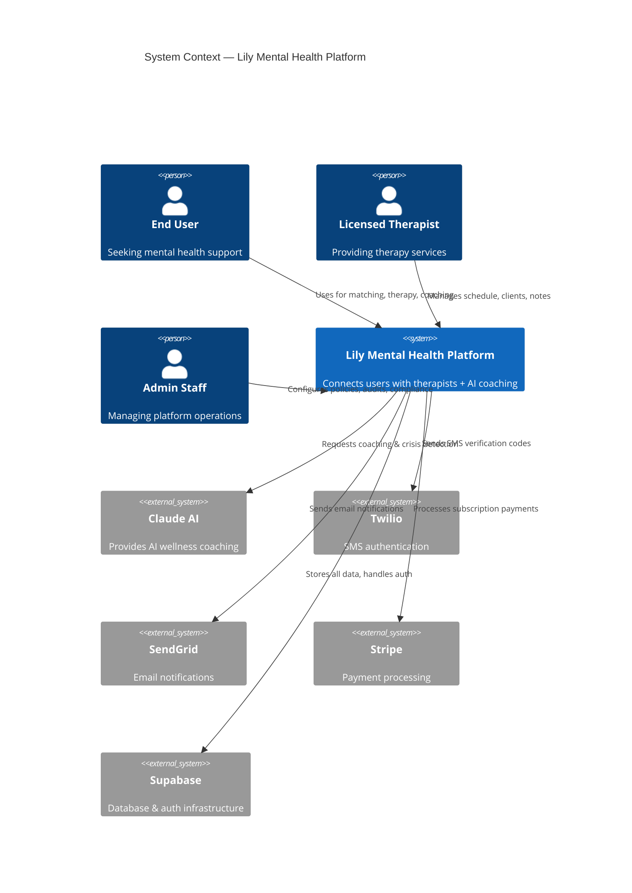
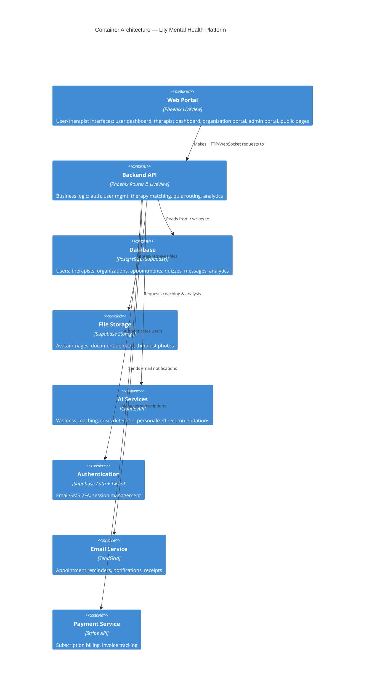
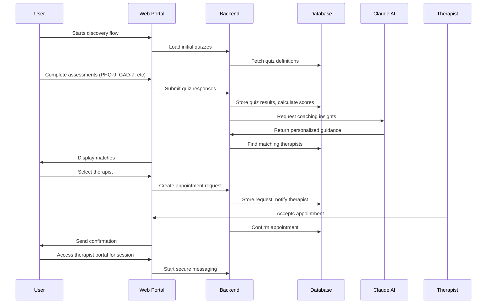
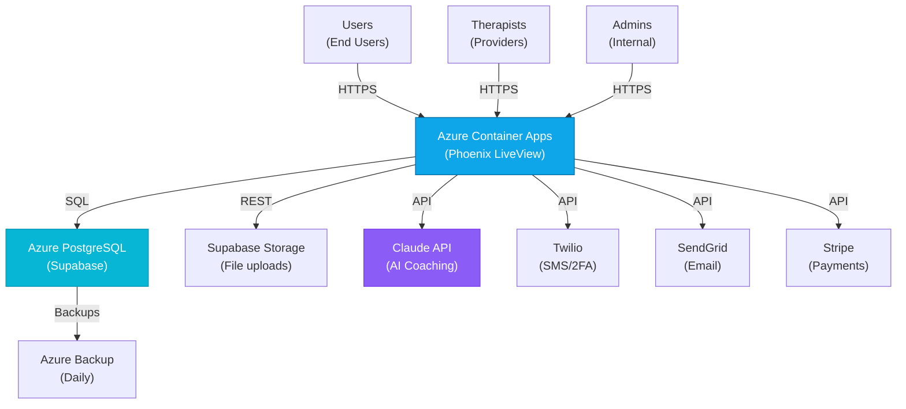

# Showcase-Fleet Agent Output Specification
**For**: fmt-20260330-showcase-fleet formation
**Project**: lily-ai-phx (v1.15.1)
**Generated**: 2026-03-30T03:00:00Z

## Master Output Directory

All agents write to a single base path that is immediately accessible via HTTP:

```
/Users/jeremiah/Developer/ccem/showcase/data/projects/lily-ai-phx/
```

This directory is served at:
- **Web Root**: `http://localhost:3001/client/`
- **Direct Access**: `http://localhost:3001/client/data/projects/lily-ai-phx/`
- **Via APM API**: `http://localhost:3032/api/showcase/lily-ai-phx`

## Wave 1: Discovery Squadron

### Agent: Codebase Analyst (w1-codebase-analyst)

**Input**:
- Project path: `/Users/jeremiah/Developer/lily-ai-phx`
- Focus: Extract C4 Context (L1) and Container (L2) patterns

**Output File**:
```
/Users/jeremiah/Developer/ccem/showcase/data/projects/lily-ai-phx/architecture-report.json
```

**File Format** (JSON):
```json
{
  "project": "lily-ai-phx",
  "version": "1.15.1",
  "abstraction_level": "C4 L1-L2",
  "system_context": {
    "external_actors": ["End Users", "Therapists", "Admin Staff"],
    "system_boundary": "Lily Mental Health Platform",
    "description": "Phoenix LiveView mental health platform connecting users with therapists"
  },
  "containers": [
    {
      "name": "Web Portal",
      "type": "Phoenix LiveView Application",
      "technology": "Elixir, Phoenix, LiveView",
      "responsibilities": "User interface for appointment booking, therapy matching, coach AI"
    },
    {
      "name": "Backend API",
      "type": "Phoenix Endpoints",
      "technology": "Elixir, Phoenix",
      "responsibilities": "Business logic, authentication, authorization"
    },
    {
      "name": "Database",
      "type": "PostgreSQL",
      "technology": "Supabase-hosted PostgreSQL",
      "responsibilities": "User data, therapist profiles, appointments, analytics"
    },
    {
      "name": "External Services",
      "type": "Third-party APIs",
      "technology": "Claude API, Twilio, SendGrid, Stripe, Supabase Storage",
      "responsibilities": "AI coaching, SMS auth, email, payments, file storage"
    }
  ],
  "key_patterns": [
    "LiveView component hierarchy",
    "RLS (Row Level Security) for multi-tenant isolation",
    "Event-driven messaging between portals",
    "Real-time updates via WebSocket"
  ]
}
```

### Agent: Narrative Architect (w1-narrative-architect)

**Input**:
- Audience: Internal team + investors
- Project description: Mental health platform with AI coaching
- Narrative frameworks: Geoffrey Moore positioning + Amazon Working Backwards

**Output File**:
```
/Users/jeremiah/Developer/ccem/showcase/data/projects/lily-ai-phx/narrative-arcs.json
```

**File Format** (JSON):
```json
{
  "project": "lily-ai-phx",
  "version": "1.15.1",
  "positioning_statement": {
    "target_market": "Organizations seeking scalable mental health support for their populations",
    "problem": "Shortage of available therapists, long waitlists, high cost per therapy session",
    "solution": "AI-powered matching system pairing users with licensed therapists, plus 24/7 AI coaching",
    "unique_value": "Combines human expertise with AI for comprehensive mental wellness support",
    "proof_points": ["72+ clinical assessment tools", "Real-time therapist matching", "Crisis detection in AI coaching"]
  },
  "press_release": {
    "headline": "Lily Launches AI-Enhanced Mental Health Platform for Instant Therapist Matching and 24/7 AI Coaching",
    "body": "Users can now find matched therapists in seconds rather than months, with 24/7 AI wellness coaching bridging gaps in care..."
  },
  "storyboard": [
    { "frame": 1, "title": "The Problem", "visual": "Long therapy waitlists, shortage of providers" },
    { "frame": 2, "title": "User Journey", "visual": "Quiz → Matching → Therapist Connection" },
    { "frame": 3, "title": "AI Coaching", "visual": "24/7 instant support with crisis detection" },
    { "frame": 4, "title": "For Organizations", "visual": "Admin portal managing employee mental health programs" },
    { "frame": 5, "title": "For Therapists", "visual": "Directory, scheduling, secure messaging, client roster" },
    { "frame": 6, "title": "Impact", "visual": "Reduced wait times, improved outcomes, lower cost per user" }
  ],
  "wave_narratives": {
    "wave_1": {
      "title": "Core Platform Launch",
      "description": "Foundation of user-therapist matching with AI wellness coaching"
    }
  }
}
```

---

## Wave 2: Generation Squadron

### Agent: Diagram Renderer (w2-diagram-renderer)

**Input**:
- architecture-report.json from Wave 1
- Diagram types: C4 Context, C4 Container, Process Flow, Deployment

**Output Files** (Mermaid format, .mmd extension):

#### Architecture Context Diagram
```
/Users/jeremiah/Developer/ccem/showcase/data/projects/lily-ai-phx/diagrams/architecture-c4-context.mmd
```

**Content**:


#### Architecture Container Diagram
```
/Users/jeremiah/Developer/ccem/showcase/data/projects/lily-ai-phx/diagrams/architecture-c4-container.mmd
```

**Content**:


#### Process Flow Diagram
```
/Users/jeremiah/Developer/ccem/showcase/data/projects/lily-ai-phx/diagrams/process-flow.mmd
```

**Content**:


#### Deployment Topology Diagram
```
/Users/jeremiah/Developer/ccem/showcase/data/projects/lily-ai-phx/diagrams/deployment-topology.mmd
```

**Content**:


### Agent: Redaction Engine (w2-redaction-engine)

**Output**: Redacted versions of diagrams (update .mmd files in place with generic labels)

**Redaction Rules Applied**:
- No specific service names (use "Service Layer" instead of "Phoenix Router")
- No vendor names at maximum redaction level (keep for light redaction)
- Metrics anonymized (ranges instead of exact numbers)
- Algorithm names abstracted

### Agent: Content Composer (w2-content-composer)

**Output Files**:

#### Narrative Content
```
/Users/jeremiah/Developer/ccem/showcase/data/projects/lily-ai-phx/narrative-content.json
```

**Format**:
```json
{
  "project": "lily-ai-phx",
  "version": "1.15.1",
  "wave_1": {
    "title": "Core Platform & AI Coaching Foundation",
    "description": "Launched user-therapist matching algorithm with real-time therapist discovery and 24/7 AI wellness coaching with crisis detection capabilities.",
    "highlights": [
      "72+ clinical assessment tools (PHQ-9, GAD-7, PSS-10, ADHD, PCSD, etc)",
      "Real-time therapist matching based on specialty and availability",
      "AI coaching with crisis detection and safety escalation",
      "Multi-role platform: user dashboard, therapist portal, admin console, org portal"
    ]
  }
}
```

#### Speaker Notes
```
/Users/jeremiah/Developer/ccem/showcase/data/projects/lily-ai-phx/speaker-notes.json
```

#### Slides
```
/Users/jeremiah/Developer/ccem/showcase/data/projects/lily-ai-phx/slides.json
```

---

## Wave 3: Presentation Squadron

### Agent: UI Builder (w3-ui-builder)

**Output Files** (optional, can be static):
```
/Users/jeremiah/Developer/ccem/showcase/data/projects/lily-ai-phx/showcase.html
/Users/jeremiah/Developer/ccem/showcase/data/projects/lily-ai-phx/presenter.html
/Users/jeremiah/Developer/ccem/showcase/data/projects/lily-ai-phx/styles.css
/Users/jeremiah/Developer/ccem/showcase/data/projects/lily-ai-phx/showcase.js
```

**Note**: The main HTML client is already at `/Users/jeremiah/Developer/ccem/showcase/client/index.html` and handles all rendering via the APM API and local data files. These additional files are supplementary.

### Agent: QA Validator (w3-qa-validator)

**Output File**:
```
/Users/jeremiah/Developer/ccem/showcase/data/projects/lily-ai-phx/validation-report.json
```

**Format**:
```json
{
  "project": "lily-ai-phx",
  "validation_timestamp": "2026-03-30T03:00:00Z",
  "checks_passed": [
    "No internal service names in diagrams",
    "No database schema details exposed",
    "No API endpoint paths revealed",
    "No algorithm identifiers exposed",
    "No infrastructure provider specifics at maximum redaction",
    "No file paths from source system",
    "No credentials or secrets detected"
  ],
  "checks_failed": [],
  "overall_status": "PASS",
  "publication_approved": true,
  "notes": "All IP protection rules met. Safe for external presentation."
}
```

---

## Immediate Web Access Pattern

Once an agent writes a file to `/Users/jeremiah/Developer/ccem/showcase/data/projects/lily-ai-phx/`, it is **immediately accessible** via:

```
HTTP Method: GET
URL: http://localhost:3001/client/data/projects/lily-ai-phx/{filename}

Example:
  Agent writes: /Users/jeremiah/Developer/ccem/showcase/data/projects/lily-ai-phx/diagrams/architecture-c4-context.mmd
  Web access: http://localhost:3001/client/data/projects/lily-ai-phx/diagrams/architecture-c4-context.mmd
```

The APM endpoint will also automatically serve the data:

```
HTTP Method: GET
URL: http://localhost:3032/api/showcase/lily-ai-phx
Returns: JSON with features, narratives, diagrams metadata, slides, speaker_notes
```

---

## Verification

After each wave completes, verify files:

```bash
# Wave 1
ls -la /Users/jeremiah/Developer/ccem/showcase/data/projects/lily-ai-phx/architecture-report.json
ls -la /Users/jeremiah/Developer/ccem/showcase/data/projects/lily-ai-phx/narrative-arcs.json

# Wave 2
ls -la /Users/jeremiah/Developer/ccem/showcase/data/projects/lily-ai-phx/diagrams/*.mmd
ls -la /Users/jeremiah/Developer/ccem/showcase/data/projects/lily-ai-phx/narrative-content.json
ls -la /Users/jeremiah/Developer/ccem/showcase/data/projects/lily-ai-phx/speaker-notes.json
ls -la /Users/jeremiah/Developer/ccem/showcase/data/projects/lily-ai-phx/slides.json

# Wave 3
ls -la /Users/jeremiah/Developer/ccem/showcase/data/projects/lily-ai-phx/validation-report.json

# Web access check
curl http://localhost:3001/client/data/projects/lily-ai-phx/features.json
curl http://localhost:3032/api/showcase/lily-ai-phx
```

---

## Configuration Environment Variables

Agents should be provided with:

```bash
export PROJECT_ID="lily-ai-phx"
export OUTPUT_BASE="/Users/jeremiah/Developer/ccem/showcase/data/projects/lily-ai-phx"
export DIAGRAMS_PATH="/Users/jeremiah/Developer/ccem/showcase/data/projects/lily-ai-phx/diagrams"
export APM_BASE_URL="http://localhost:3032"
export WEB_PORT="3001"
export WEB_HOST="http://localhost:3001"
export PROJECT_REPO="/Users/jeremiah/Developer/lily-ai-phx"
export PROJECT_VERSION="1.15.1"
```

---

## Client Configuration

The showcase client at `http://localhost:3001/client/index.html?project=lily-ai-phx` automatically:

1. Parses `project=lily-ai-phx` from URL
2. Looks up project in `/data/projects.json` → finds `data_path: projects/lily-ai-phx`
3. Loads `/data/projects/lily-ai-phx/features.json` (already exists with 8 features)
4. Attempts to load APM endpoint: `http://localhost:3032/api/showcase/lily-ai-phx`
5. Renders diagrams, narratives, and features in real-time

No additional configuration needed in the HTML client.

---

**Last Updated**: 2026-03-30T03:00:00Z
**Status**: Ready for formation deployment
