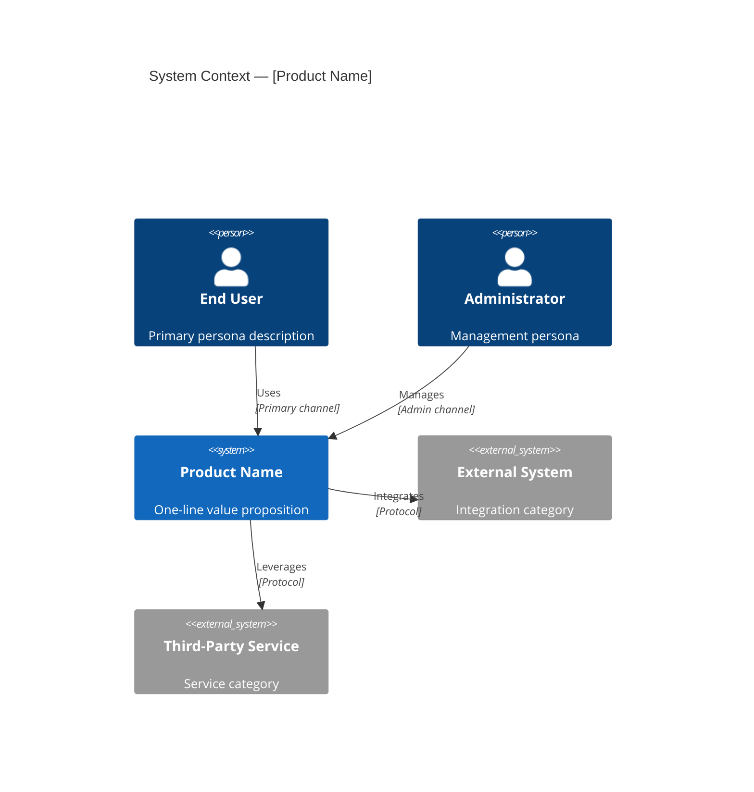
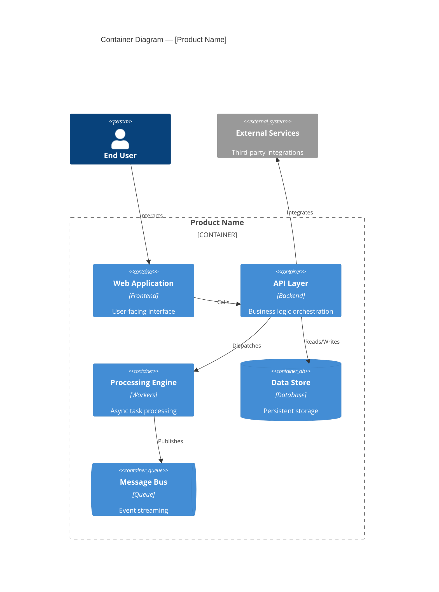
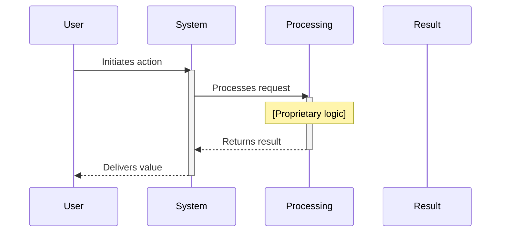
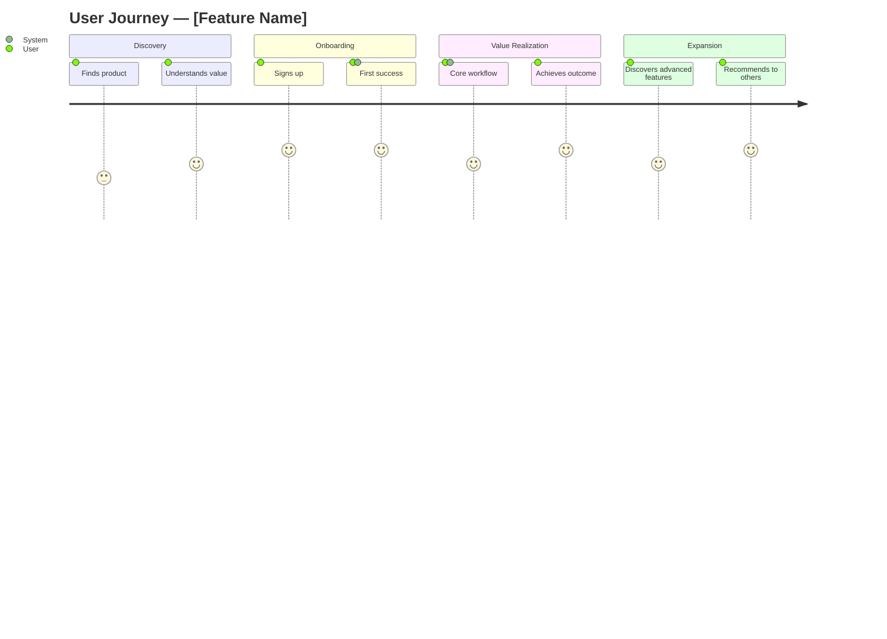

# Showcase — IP-Safe Architecture & Process Flow Presenter

Generate investor-grade architecture diagrams, process flows, and product narratives that reveal strategic vision without exposing implementation details. Uses C4 model abstraction to enforce IP boundaries automatically.

## Core Concept: Abstraction as IP Protection

```
┌─────────────────────────────────────────────────────┐
│  C4 ABSTRACTION LEVELS                              │
│                                                     │
│  L1 Context    ← EXTERNAL SAFE (investors, public)  │
│  L2 Container  ← EXTERNAL SAFE (partners, demos)    │
│  ─────────── IP BOUNDARY ───────────                │
│  L3 Component  ← INTERNAL ONLY (team, board)        │
│  L4 Code       ← INTERNAL ONLY (engineering)        │
└─────────────────────────────────────────────────────┘
```

**Audience → Max Abstraction Level:**
- `investor` → L1 Context + L2 Container (high-level system boundaries only)
- `partner` → L2 Container + selective L3 (integration points visible)
- `product-demo` → L1 Context + L2 Container + UX flows (no internals)
- `board` → L1 Context + business metrics overlay
- `internal` → All levels (no redaction)

## Subcommands

### `/showcase plan`
Interactive planning wizard (6 questions):

1. **Q1 — Audience**: Who is this for?
   - `[1]` Investor (Series A-C, angels, VCs)
   - `[2]` Partner (integration partner, reseller, API consumer)
   - `[3]` Product Demo (prospect, conference, product hunt)
   - `[4]` Board (board of directors, advisory board)
   - `[5]` Internal (team, engineering, all-hands)

2. **Q2 — Subject**: What system/product/feature to showcase?
   - Free-text description or path to codebase to analyze
   - If path provided: auto-scan for architecture patterns

3. **Q3 — Narrative Arc**: What story to tell?
   - `[1]` Problem → Solution → Traction → Vision (investor pitch)
   - `[2]` Integration → Value → Roadmap (partner)
   - `[3]` Before → After → How It Works (product demo)
   - `[4]` Status → Metrics → Strategy → Ask (board update)
   - `[5]` Custom narrative structure

4. **Q4 — Diagram Types**: Which visualizations?
   - `[1]` System Context (C4 L1 — actors + system boundary)
   - `[2]` Container (C4 L2 — services, databases, APIs)
   - `[3]` Process Flow (sequence/activity diagrams)
   - `[4]` Data Flow (how data moves through the system)
   - `[5]` Deployment (infrastructure topology)
   - `[6]` User Journey (persona-driven flow)
   - `[7]` All applicable (auto-select based on audience)
   - `[8]` Data Flow — Yourdon-DeMarco DFD (processes, data stores, external entities)
   - `[9]` Formation Topology — CCEM Formation Model (squadron/swarm/cluster hierarchy)

5. **Q5 — Redaction Level**: How aggressively to abstract?
   - `[1]` Maximum — generic labels, no tech stack, no vendor names
   - `[2]` Moderate — tech categories visible, specific tools hidden
   - `[3]` Light — stack visible, algorithms/logic hidden
   - `[4]` None — full transparency (internal only)

6. **Q6 — Output Format**:
   - `[1]` Interactive HTML (glassmorphism, presenter console)
   - `[2]` Mermaid markdown (embeddable, version-controlled)
   - `[3]` PDF export (static, shareable)
   - `[4]` Slide deck (wrapped slideshow format)
   - `[5]` All formats

**Output**: `showcase-manifest.json` in working directory

### `/showcase scaffold`
Generate file structure from manifest:
```
<output-dir>/
  client/
    index.html            # Main showcase viewer
    presenter.html        # Presenter console with notes + timer
    styles.css            # Glassmorphism design system
    showcase.js           # Diagram rendering + navigation
    diagrams/
      context.mmd         # C4 L1 Context diagram (Mermaid)
      containers.mmd      # C4 L2 Container diagram (Mermaid)
      process-flow.mmd    # Sequence/activity diagram
      data-flow.mmd       # Data flow diagram
      user-journey.mmd    # User journey diagram
      deployment.mmd      # Deployment topology
  data/
    manifest.json         # Showcase configuration
    narrative.json        # Story arc content blocks
    redaction-rules.json  # IP protection rules
    speaker-notes.json    # Presenter talking points
    diagrams.json         # Diagram metadata + annotations
  showcase-manifest.json  # Source manifest
```

### `/showcase generate`
Build all diagrams and narrative from manifest. This is the main generation command.

**Generation pipeline:**
1. Analyze subject (codebase scan or description parsing)
2. Build internal architecture model (full detail)
3. Apply redaction rules per audience level
4. Generate Mermaid diagrams at permitted abstraction levels
5. Compose narrative blocks (positioning + press-release frameworks)
6. Render to selected output format
7. Validate: no IP leakage check against redaction rules

### `/showcase redact [--level maximum|moderate|light|none]`
Apply or adjust redaction to existing showcase:

**Redaction transforms:**
| Element | Maximum | Moderate | Light | None |
|---------|---------|----------|-------|------|
| Service names | Generic ("Service A") | Category ("API Gateway") | Actual name | Full |
| Tech stack | Hidden | Categories ("NoSQL DB") | Visible ("MongoDB") | Full |
| Vendor names | Hidden | Hidden | Visible | Full |
| Algorithms | "Proprietary Logic" | "ML Pipeline" | "Transformer Model" | Full |
| Data schemas | "Structured Data" | "User Records" | Table names | Full |
| API endpoints | Hidden | "REST API" | Route patterns | Full |
| Infrastructure | "Cloud Platform" | "Container Orchestration" | "AWS EKS" | Full |
| Metrics/scale | Relative ("10x growth") | Ranges ("1M-5M users") | Exact | Full |
| Team size | Hidden | "Small team" | Headcount | Full |
| Pricing | Hidden | "Usage-based" | Tier structure | Full |

### `/showcase present`
Launch interactive presenter mode:
- Opens HTML in browser with presenter console
- Speaker notes per diagram/section
- Timer with section pacing guides
- Diagram annotation overlay (click to highlight + explain)
- Audience Q&A parking lot
- Navigation: arrow keys or slide index

### `/showcase export [--format html|pdf|mermaid|slides]`
Export to distributable format:
- `html` — Self-contained single-file HTML (all assets inlined)
- `pdf` — Print-optimized with page breaks per section
- `mermaid` — Raw .mmd files only (for embedding elsewhere)
- `slides` — Wrapped slideshow format (OpsDOC compatible)

## Mermaid Diagram Templates

### C4 L1 — System Context (Investor-Safe)


### C4 L2 — Container (Partner-Safe)


### Process Flow (Audience-Adaptive)


### User Journey


## Narrative Frameworks (Per Audience)

### Investor Narrative
Combines **positioning-statement** + **press-release** + **storyboard** frameworks:
1. **The Problem** — Market pain, quantified (TAM/SAM reference)
2. **The Insight** — Why now, what changed
3. **The Solution** — System context diagram + value proposition
4. **How It Works** — Container diagram + process flow (redacted)
5. **Traction** — Metrics at permitted disclosure level
6. **Moat** — Architecture as competitive advantage (abstracted)
7. **Vision** — Roadmap diagram + deployment topology
8. **The Ask** — What you need, what you'll build

### Partner Narrative
1. **Integration Story** — How systems connect (container diagram)
2. **Data Flow** — What data moves where (data flow diagram)
3. **Value Chain** — Joint value proposition
4. **Technical Fit** — API surface + protocol compatibility
5. **Roadmap** — Joint integration timeline

### Product Demo Narrative
1. **Before State** — User journey without product
2. **The Moment** — Product introduction (storyboard frame)
3. **Walkthrough** — Process flow with user journey overlay
4. **After State** — Transformed user journey
5. **Under the Hood** — Container diagram (redacted per audience)

## IP Leakage Validation

After generation, the skill runs a validation pass:

```
IP LEAKAGE CHECK:
✓ No internal service names in external-audience diagrams
✓ No specific technology versions exposed
✓ No database schema details visible
✓ No API endpoint paths revealed
✓ No algorithm names or ML model identifiers
✓ No infrastructure provider specifics
✓ No team member names or counts
✓ No pricing or financial specifics beyond permitted level
✓ No code snippets or pseudocode
✓ No internal project identifiers or ticket numbers
```

## Formation Deployment

This skill supports `/formation deploy showcase-fleet` for parallel generation:

```
showcase-fleet
├── Squadron: Discovery (Wave 1)
│   ├── Codebase Analyst    — scans repos, extracts architecture patterns
│   └── Narrative Architect — builds story arc from PM frameworks
├── Squadron: Generation (Wave 2)
│   ├── Diagram Renderer    — generates all Mermaid diagrams
│   ├── Redaction Engine    — applies IP protection transforms
│   └── Content Composer    — writes narrative blocks + speaker notes
└── Squadron: Presentation (Wave 3)
    ├── UI Builder          — glassmorphism HTML + presenter console
    └── QA Validator        — IP leakage check + visual review
```

## Design System

Inherits from OpsDOC glassmorphism with showcase-specific additions:

**Theme**: `showcase-obsidian` (dark, high contrast for projector/screen)
- Primary: `#0a0a0f` (near-black background)
- Accent: `#6366f1` (indigo — professional, tech-forward)
- Diagram bg: `rgba(15, 15, 25, 0.85)` (frosted dark glass)
- Text: `#e2e8f0` (soft white, easy on eyes)
- Highlight: `#818cf8` (lighter indigo for emphasis)
- Success: `#34d399` (metrics, traction)
- Warning: `#fbbf24` (callouts, asks)

**Typography**:
- Headings: Inter (clean, modern)
- Body: Inter
- Diagrams: Fira Code (monospace, technical feel)
- Metrics: Tabular numerals (Inter)

## Subcommand: `/showcase diagrams`

Diagram design system management commands:

- `diagrams list` — List all supported diagram types with their C4 abstraction levels and audience compatibility
- `diagrams check-updates` — Check `data/resource-cache-manifest.json` for version updates against upstream registries
- `diagrams cache` — Download and cache all pinned DRTW resources locally for offline rendering
- `diagrams theme` — Show current branding/theme configuration (`showcase-obsidian` defaults + overrides)
- `diagrams animate [on|off]` — Toggle diagram animation (anime.js progressive reveal, timeline playback)

## Animation System

Post-render animation and annotation for diagrams and presenter mode:

- **anime.js** (v4) — SVG post-render animation: progressive reveal of diagram nodes/edges, timeline playback for sequenced flows, wave deploy animation for formation topologies
- **Lottie** — Decorative transitions only (slide transitions, loading states). Never used for diagram content rendering
- **RoughNotation** — Presenter mode annotation highlights: underline, box, circle, bracket overlays triggered by click or keyboard in `/showcase present`

**Authoritative config**: `data/diagram-design-system.json` — defines animation timing, easing curves, stagger intervals, and per-diagram-type animation presets.

**Resource manifest**: `data/resource-cache-manifest.json` — pinned versions and CDN URLs for all DRTW dependencies.

## DRTW Resource References

| Resource | Version | License | Purpose |
|----------|---------|---------|---------|
| Mermaid | v11 | MIT | Diagram rendering engine |
| anime.js | v4 | MIT | SVG animation (progressive reveal, timeline, wave) |
| Lottie Player | latest | MIT | Decorative transition animations |
| RoughNotation | v0.5 | MIT | Presenter mode annotation highlights |
| C4-PlantUML | v2.12.0 | MIT | C4 diagram template reference |
| Simple Icons | v16 | CC0 | Tech brand SVGs for labeled nodes |
| Heroicons | v2.1 | MIT | UI diagram icons |
| Devicon | v2.17 | MIT | Dev tool / language icons |
| draw.io libs | latest | Apache 2.0 | Stencil libraries for extended shapes |

## Standards Compliance

Diagram outputs conform to these specifications:

| Standard | Version | Reference |
|----------|---------|-----------|
| UML | 2.5.1 | https://www.omg.org/spec/UML/2.5.1/ |
| C4 Model | current | https://c4model.com/ |
| ArchiMate | 3.2 | https://pubs.opengroup.org/architecture/archimate3-doc/ |
| BPMN | 2.0.2 | https://www.omg.org/spec/BPMN/2.0.2/About-BPMN |

## Examples

### Minimal (Investor, Maximum Redaction)
```bash
/showcase plan
# Q1: investor, Q2: "Real-time data processing platform", Q3: Problem→Solution→Traction→Vision
# Q4: All applicable, Q5: Maximum, Q6: Interactive HTML
/showcase generate
/showcase present
```

### Partner Integration
```bash
/showcase plan
# Q1: partner, Q2: ./src (scan codebase), Q3: Integration→Value→Roadmap
# Q4: Container + Data Flow + Process Flow, Q5: Moderate, Q6: Mermaid + HTML
/showcase generate
/showcase export --format html
```

### Product Demo with Custom Narrative
```bash
/showcase plan
# Q1: product-demo, Q2: "AI-powered workflow automation", Q3: Custom
# Q4: User Journey + Process Flow, Q5: Light, Q6: Slides
/showcase scaffold
/showcase generate
/showcase export --format slides
```
